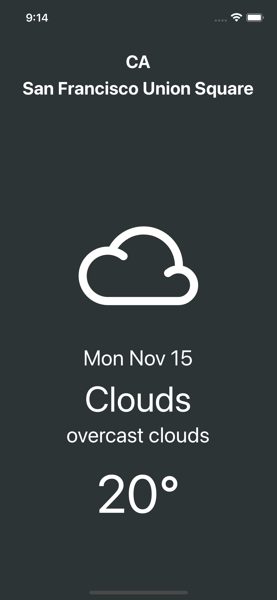
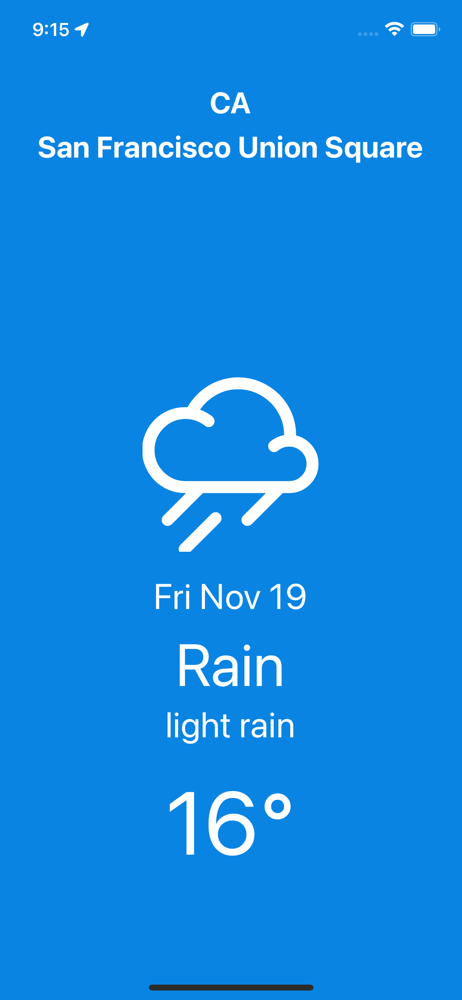
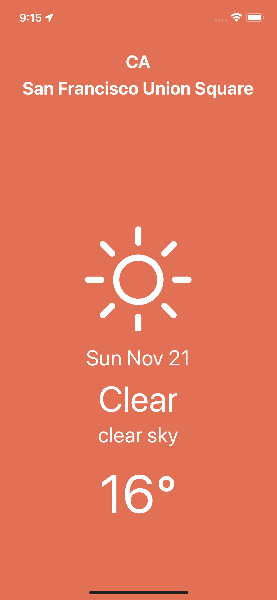
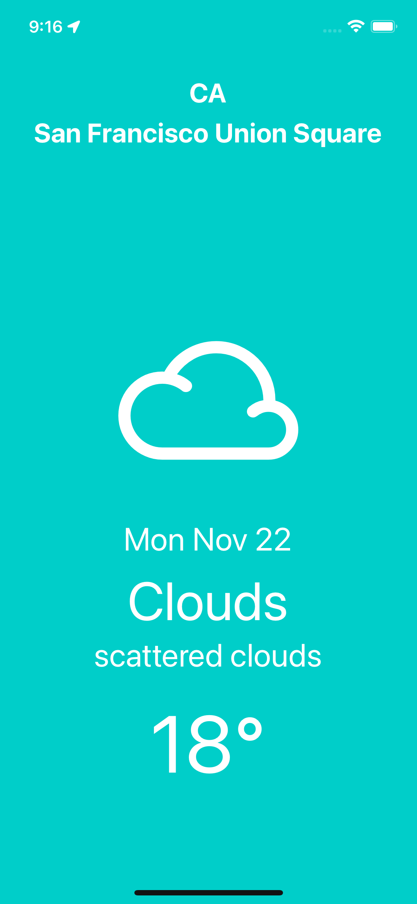

# React-Native-Weather-App2

## 🔗 Demo

https://expo.dev/@sugargw/weather-app2

#### With Android or iPhone, You can scan this QR code with your Expo Mobile App to load this project immediately.

## 🖥 Preview

   

## 🔥 Stack

### Front-end

 

## ✅ Packages

- [x] React
- [x] React Native
- [x] Expo

## 📖 Theory

- [x] React Native Foundations
- [x] Styles on React Native
- [x] Data Fetching
- [x] Geolocation
- [x] Permissions
- [x] Font Icons

## ⚙ Features

- [x] Weather App
- [x] Phone Geolocation
- [x] Address Geocoding
